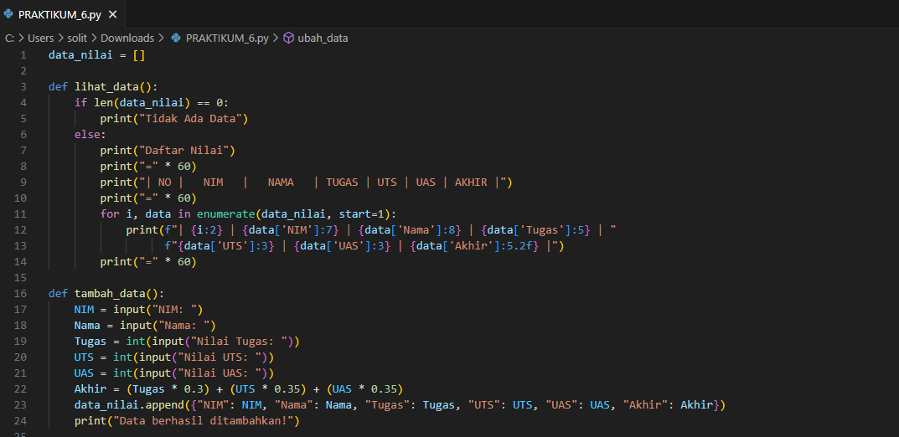
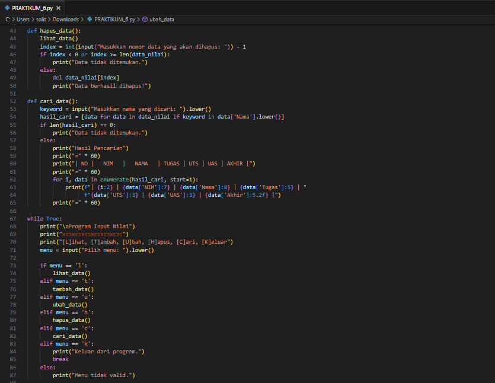
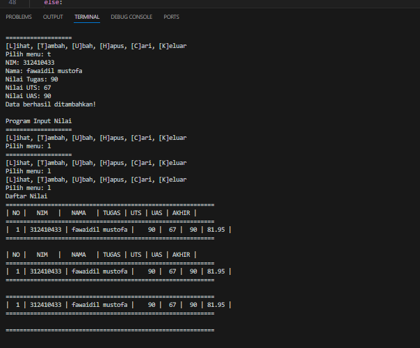

# praktikum6

Berikut adalah program Python sederhana yang memenuhi semua kriteria:

Program Python
data nilai

hasil output

Nilai Akhir: Dihitung menggunakan formula:
Nilai Akhir
=
(
Tugas
×
0.3
)
+
(
UTS
×
0.35
)
+
(
UAS
×
0.35
)
Nilai Akhir=(Tugas×0.3)+(UTS×0.35)+(UAS×0.35)
Menu: Program terus berjalan hingga pengguna memilih opsi Keluar.
Program ini dapat langsung dijalankan di Python untuk mengelola data nilai mahasiswa.
